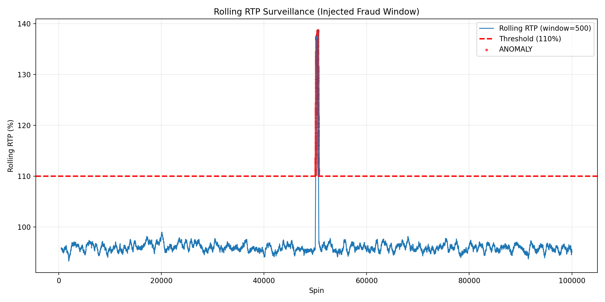

# Casino Surveillance Integrity Auditor (PoC)

### 🚨 Operational Context
In land-based gaming, hardware malfunctions (e.g., hopper jams, sensor errors) or malicious manipulation (e.g., EPROM tampering) often manifest as statistical anomalies in transactional data. This tool demonstrates a programmatic approach to detecting these irregularities in real-time using Rolling Window Analysis.

### 📊 The Anomaly Detection Logic
The script simulates a stream of 100,000 spin cycles and applies a **500-spin Rolling Average** to the Return to Player (RTP) metric.

**Fraud Scenario Simulated:**
* **Baseline:** Standard volatility slot (~96% RTP).
* **Injection:** A forced "payout spike" event injected at spin 50,000 (simulating a compromised machine).
* **Detection:** The algorithm triggers an alert when the Rolling RTP breaches the **110% Safety Threshold**.

### 📉 Visualization

*Figure 1: The algorithm successfully isolates the fraud window (Red Zone) from normal volatility noise.*

### 🛠 Tech Stack
* **Python:** Core logic & Simulation
* **Pandas:** Data frames & Rolling Window calculations
* **Matplotlib:** Data visualization & Reporting

---
*Author: Enej Žbogar | Gaming Integrity & Hardware Specialist*
